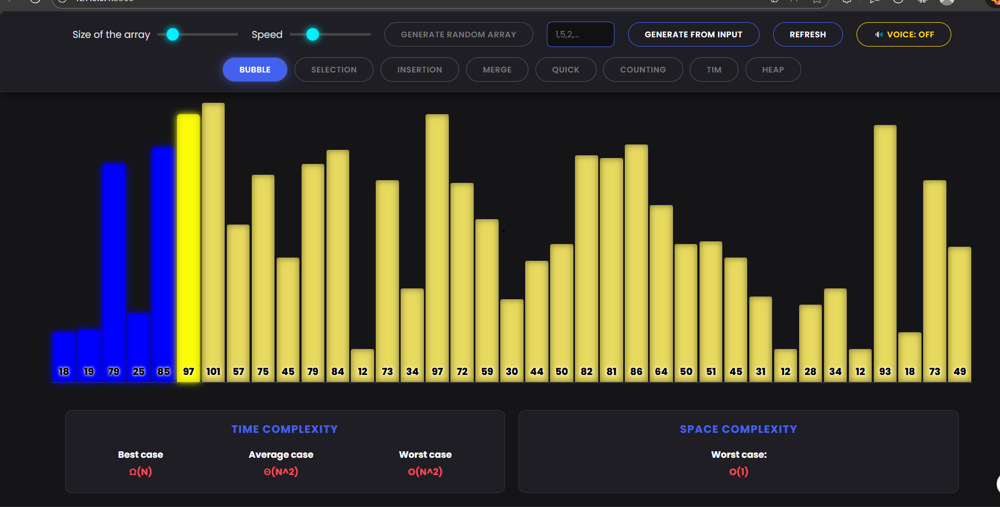

# ⚡ Sorting Visualizer with Voice Assistant



An interactive web application to visualize how sorting algorithms work in real-time.  
It includes a built-in **Voice Assistant** that narrates comparisons, swaps, and merge operations step-by-step.

---

## 🚀 About The Project

This project provides a modern, dark-themed sorting visualizer built entirely with **HTML**, **CSS**, and **Vanilla JavaScript**.  
No frameworks. No external libraries.

It also includes:

- Neon-themed responsive UI  
- Real-time algorithm explanation  
- Dynamic controls and user input  
- Text-to-Speech narration of algorithm steps  

---

## 🌟 Key Features

- **8 Sorting Algorithms**  
  Bubble, Selection, Insertion, Merge, Quick, Heap, Counting, and Tim Sort.
- **🗣️ Voice Assistant**  
  Narrates comparisons, swaps, and merges (full narration at slowest speed).
- **Custom Input Support**  
  Enter your own values to visualize any case.
- **Dynamic Controls**  
  Adjust array size, speed, and toggle voice on/off.
- **Real-Time Complexity Display**
- **Fully Responsive Neon UI**

---

## 🛠️ Tech Stack

- **HTML5**
- **CSS3** (Flexbox, Grid, Animations)
- **JavaScript (ES6+)**
- **No external libraries**

---

## ⚙️ How to Run Locally

No installation. No build. Just open the HTML file.

```sh
# Clone the repository
git clone https://github.com/your-username/sorting-visualizer.git

# Navigate into the folder
cd sorting-visualizer
